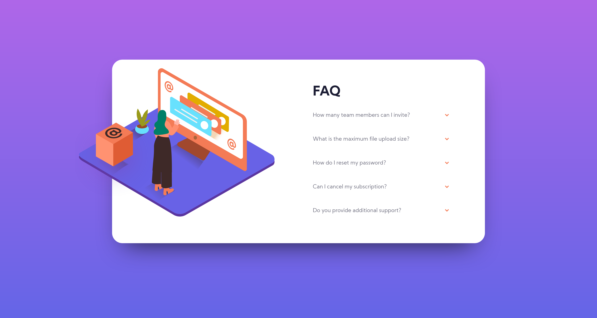
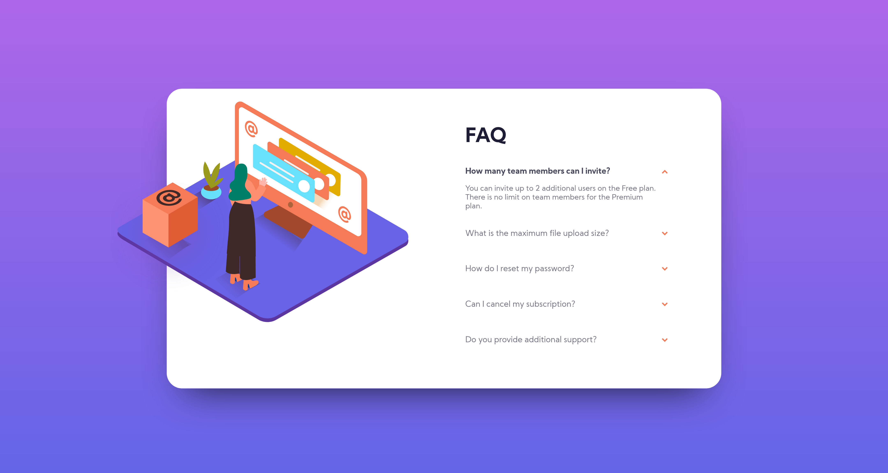

# Frontend Mentor - FAQ accordion card solution

This is a solution to the [FAQ accordion card challenge on Frontend Mentor](https://www.frontendmentor.io/challenges/faq-accordion-card-XlyjD0Oam). Frontend Mentor challenges help you improve your coding skills by building realistic projects.

## Table of contents

- [Overview](#overview)
  - [The challenge](#the-challenge)
  - [Screenshot](#screenshot)
  - [Links](#links)
- [My process](#my-process)
  - [Built with](#built-with)
  - [What I learned](#what-i-learned)
  - [Useful resources](#useful-resources)
- [Author](#author)

## Overview

### The challenge

Users should be able to:

- View the optimal layout for the component depending on their device's screen size
- See hover states for all interactive elements on the page
- Hide/Show the answer to a question when the question is clicked

### Screenshot





### Links

- Solution URL: [FAQ accordion card solution - GitHub](https://github.com/sunil-sharma-999/FAQ-accordion-card-solution/)
- Live Site URL: [FAQ accordion card solution](https://sunil-sharma-999.github.io/FAQ-accordion-card-solution//)

## My process

### Built with

- Semantic HTML5 markup
- CSS custom properties
- Flexbox
- Mobile-first workflow
- Javascript

### What I learned

code:

```js
const q = document.querySelectorAll('.q');
const a = document.querySelectorAll('.a');

q.forEach((i) => {
  i.addEventListener('click', (e) => {
    const tag = e.target.parentElement.classList;
    answer(tag);
  });
});

function answer(tag) {
  if (tag.contains('show') && tag.contains('q-container') === false) {
    tag.remove('show');
    tag.add('remove');
  } else if (tag.contains('remove') || tag.contains('q-container') === false) {
    tag.remove('remove');
    tag.add('show');
  } else {
    console.log('Learn to aim -_-');
  }
}
```

### Useful resources

- [Stackoverflow](https://stackoverflow.com/)

## Author

- GitHub - [Sunil Sharma](https://github.com/sunil-sharma-999/)
- Frontend Mentor - [@sunil-sharma-999](https://www.frontendmentor.io/profile/sunil-sharma-999)
- Instagram - [@sunil-sharma-9](https://www.instagram.com/sunil.sharma.9)
- Linkedin - [@sunil-sharma-9](https://www.instagram.com/sunil.sharma.9)
